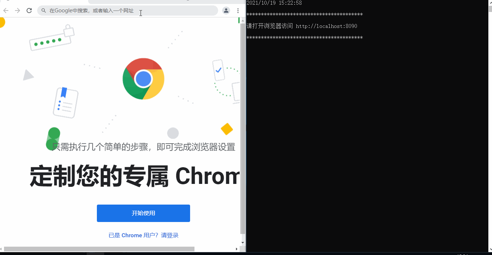
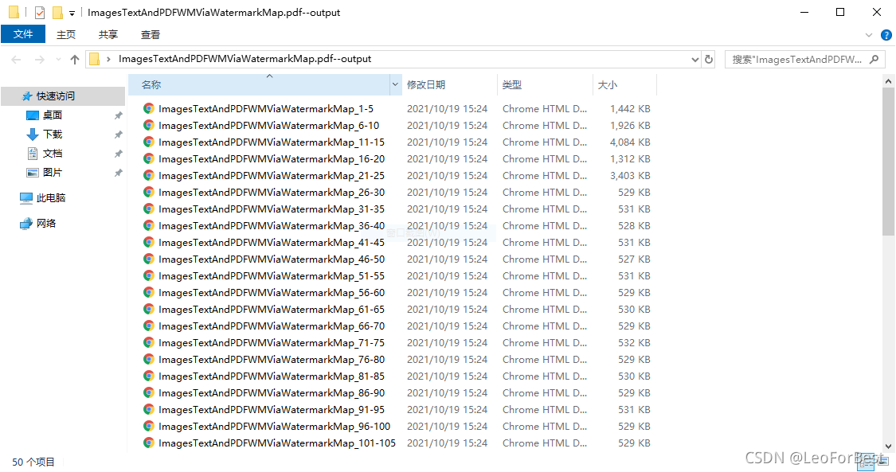

## 演示





## 前端

```bash
cd web
# 安装依赖库
yarn
# 运行
npm run dev
```

## 后端

```bash
git clone https://github.com/pdfcpu/pdfcpu
cd pdfcpu/cmd/pdfcpu
# 清楚该目录下面所有文件
rm -v *
# 复制client\main.go 和 static到该目录下
go build -ldflags "-s -w" -o pdfsplit.exe main.go
# 加壳减小体积
upx -9 .\pdfsplit.exe

```